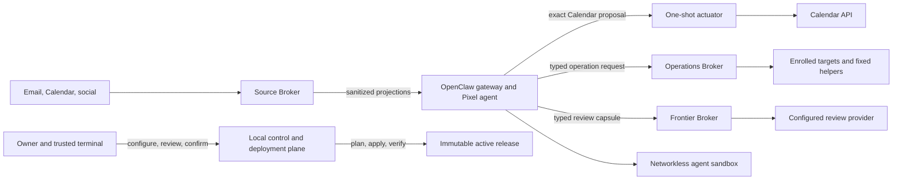

# Pixel architecture overview

Pixel is a set of capability boundaries around one conversational gateway. Data enters through bounded projections; consequential effects leave through separately authenticated brokers or actuators; evidence returns without giving the model new authority.

## Owner and deployment plane

The dedicated non-root owner runs bootstrap, configuration, planning, activation, verification, backup, restore, and update workflows. `./pixel ui` is a loopback-only process for owner-private conversation and bounded setup/status actions. It cannot receive credentials, activate a deployment, approve broker work, restore/decrypt a backup, or provide a generic command/file surface.

Installed releases are immutable directories selected through an atomic active pointer. Private credentials, policies, broker state, projections, receipts, and workspace data are host state—not release contents.

## Gateway and sandbox

The gateway runs as the unprivileged deployment identity, binds loopback with token authentication, loads one configured Pixel agent, and receives only approved plugins. Its agent-scoped sandbox has no network, a read-only root, a non-root user, dropped capabilities, and one bounded writable workspace.

The gateway is trusted for dialogue and typed request creation. It is not trusted with source OAuth material, Operations SSH authority, Frontier credentials/policy, or arbitrary host execution.

## Source and actuator plane

The dedicated Source Broker owns source credentials, reads external systems, sanitizes hostile content, and writes typed projections the gateway can read but not modify. Raw bodies and credentials do not enter the projection.

Calendar writes become exact proposals. Only narrowly enabled reversible direct shapes can proceed automatically; consequential changes require a protected snapshot and separate exact-hash terminal approval. Read access is not write authority.

## Operations plane

The Operations Broker owns its private policy, isolated SSH identity, target pins, immutable plans, grants/leases, budgets, pause state, and results. The gateway can request named actions but cannot read or replace broker authority. Target execution is bounded by fixed helpers, dedicated runners, and verification/rollback contracts.

## Frontier plane

The Frontier Broker receives only typed plan-review or failure-triage work after a local attempt. It classifies disclosure, rejects never-egress content, replaces supported identifiers, binds policy/budget/provider identity, and invokes a tool-disabled provider path only when allowed. Results are validated and finalized locally. This is software-mediated egress, not a physical air gap.

## Deep Work and provider source

Deep Work and multi-provider source define additional inert planning, custody, qualification, runner, and recovery contracts. The [current status registry](../status.md) is authoritative: source presence does not enable runtime authority. These paths do not reuse Operations or Frontier as generic runners.

## Release and evidence plane

Release manifests, qualification matrices, compatibility records, immutable archives, runtime attestations, and lifecycle receipts bind exact identities and state transitions. Each artifact proves only its schema and boundary. See [trust, authority, and evidence](trust-authority-and-evidence.md) and [status and evidence](status-and-evidence.md).
